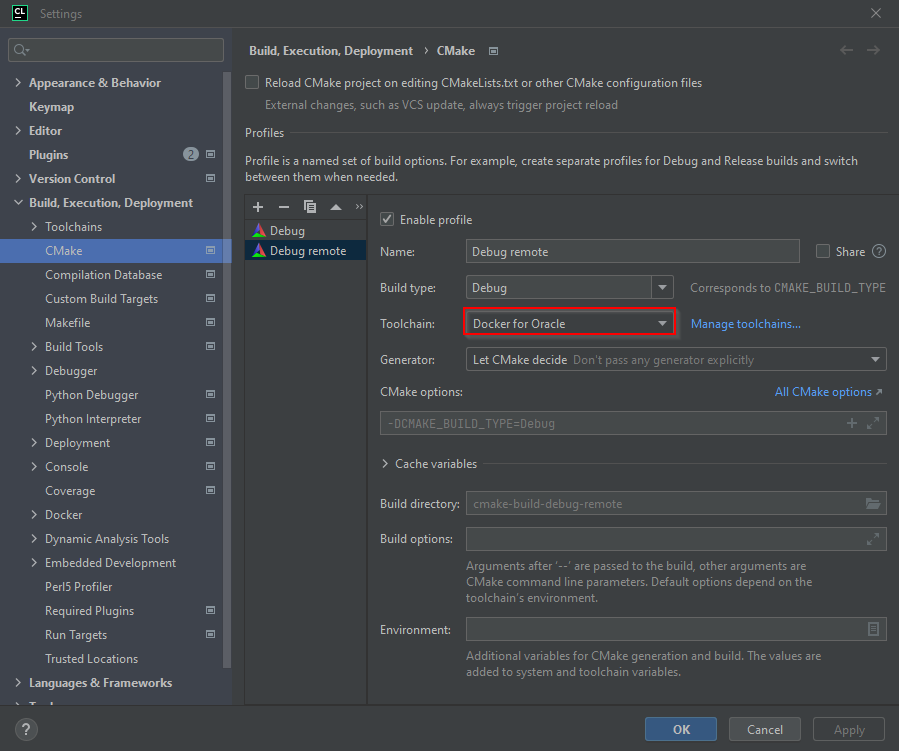
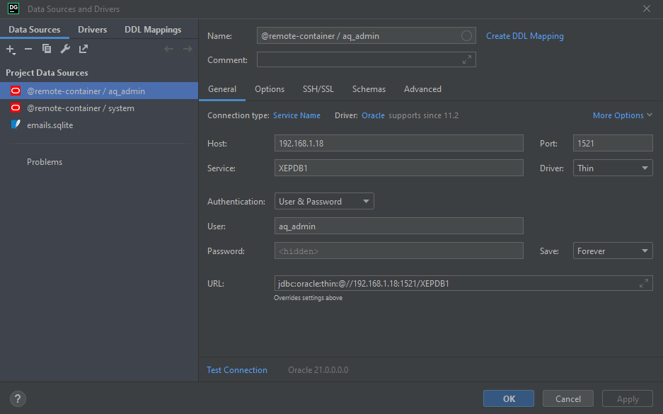
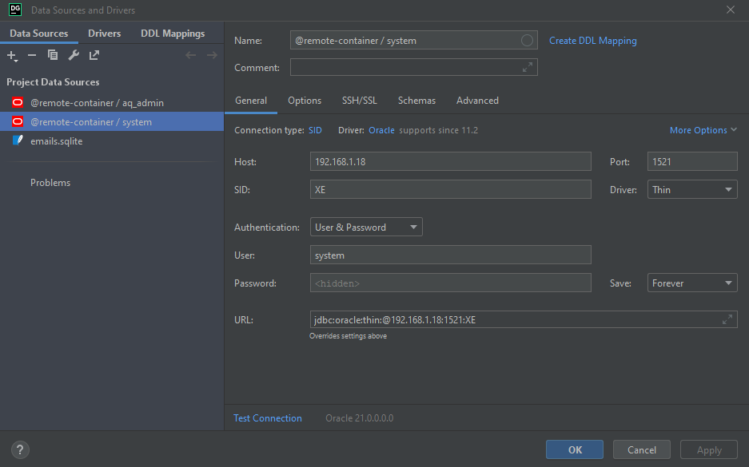

# Oracle XE 21c development environment

This repository contains an Oracle development environment in the form of an image.

This image contains an Oracle Linux 8 installation, with all the necessary tools for C programing, and SSH enabled access. It can be used to build applications for Oracle.

# Building the image

```bash
docker build --tag oracle-8-dev --file Dockerfile.dev .
```

> [Related commands](doc/docker-images.md)

# Create a container and start it

```bash
docker run --detach \
           --net=bridge \
           --interactive \
           --tty \
           --rm \
           --ip=192.17.0.2 \
           --publish 2222:22/tcp \
           --publish 7777:7777/tcp \
           oracle-8-dev
```

> MS-DOS: [here](doc/start-dev-env.md)
>
> [Related commands](doc/docker-containers.md)
>
> Setting IP addresses to the containers is interesting since we don't want to change our configurations every day.

# Connecting to the container

The OS is configured with 2 UNIX users:

| user               | password           |
|--------------------|--------------------|
| `root`             | `root`             |
| `dev`              | `dev`              |

SSH connexions using the provided private key [data/private.key](data/private.key):

## From the host that runs the container

```bash
ssh -o IdentitiesOnly=yes -o IdentityFile=data/private.key -p 2222 root@localhost
ssh -o IdentitiesOnly=yes -o IdentityFile=data/private.key -p 2222 dev@localhost
```

> Make sure that the private key file has the right permission (`chmod 600 data/private.key`).
>
> You may need to clean the host SSH configuration: `ssh-keygen -f "/home/denis/.ssh/known_hosts" -R "[localhost]:2222"`

SSH connexions using UNIX password:

```bash
ssh -o IdentitiesOnly=yes -p 2222 root@localhost
ssh -o IdentitiesOnly=yes -p 2222 dev@localhost
```

## From a distant host

We assume that the container is running on a host that runs Ubuntu `22.04`.

> We call "the container's" host the host that runs the container.

```bash
$ lsb_release -a
No LSB modules are available.
Distributor ID:      Ubuntu
Description:  Ubuntu 22.04.1 LTS
Release:      22.04
Codename:     jammy
```

On the container's host, get the IP address of the interface connected to the local network:

```bash
ip -f inet addr show $(route | grep '^default' | grep -o '[^ ]*$') | grep -E '^\s+inet\s' | awk '{print $2}'
```

For example:

```bash
$ ip -f inet addr show $(route | grep '^default' | grep -o '[^ ]*$') | grep -E '^\s+inet\s' | awk '{print $2}'
192.168.1.18/24
```

In this case the IP address of the container's host is `192.168.1.18`.

> You can configure the DHCP server of your Internet router so that this host will always get the same IP address.

Then, if you don't block the port 2222 on the container's host, you can connect from another host:

```bash
ssh -o IdentitiesOnly=yes -o IdentityFile=data/private.key -p 2222 root@192.168.1.18
ssh -o IdentitiesOnly=yes -o IdentityFile=data/private.key -p 2222 dev@192.168.1.18
```

Or:

```bash
ssh -o IdentitiesOnly=yes -p 2222 root@192.168.1.18
ssh -o IdentitiesOnly=yes -p 2222 dev@192.168.1.18
```

# Stop the container

```bash
docker ps --filter="ancestor=oracle-8-dev"
docker stop <container id>
```

# Oracle XE 21c database

## Getting the image

```bash
docker pull gvenzl/oracle-xe:latest
docker images
``` 

## Start the database

```bash
docker run --detach \
           --net=bridge \
           --publish 1521:1521 \
           --env ORACLE_PASSWORD=1234 \
           --volume oracle-volume:/opt/oracle/oradata \
           --ip=172.17.0.3 \
           gvenzl/oracle-xe
```

**Warning**: the Docker option `--volume` creates a volume for the container. This way, data is kept throughout container lifecycles. While this is the intended behavior, it may cause troubles.

> MS-DOS: [here](doc/start-db.md)
>
> [Related commands](doc/docker-containers.md)
>
> Setting IP addresses to the containers is interesting since we don't want to change our configurations every day.
>
> **TROUBLESHOOTING**
>
> * If you cannot connect to the database, make sure that the IP address you are using is correct.
> * If the container stops right after it started, then rerun the command without the option `--detach`.
>   This will allow you to consult startup messages.
> * You may need to delete the volume (`oracle-volume`):
>    * First, remove all containers that use the volume: `docker ps --all`, `docker rm ...`
>    * Then, remove the volume: `docker volume rm oracle-volume`

## Connect to the database

We will use the container that runs the development environment (image `oracle-8-dev`) to connect to the database (that runs on the other container, which image is `gvenzl/oracle-xe`).

```bash
$ docker ps
CONTAINER ID   IMAGE              COMMAND                  CREATED       STATUS       PORTS                                       NAMES
32b79811e097   oracle-8-dev       "/usr/sbin/sshd -D"      3 hours ago   Up 3 hours   0.0.0.0:2222->22/tcp, :::2222->22/tcp       hungry_sinoussi
d0b3165c854e   gvenzl/oracle-xe   "container-entrypoin…"   3 hours ago   Up 3 hours   0.0.0.0:1521->1521/tcp, :::1521->1521/tcp   my-database
```

Get the IP addresses of the containers:

```bash
$ docker ps
CONTAINER ID   IMAGE              COMMAND                  CREATED       STATUS       PORTS                                       NAMES
32b79811e097   oracle-8-dev       "/usr/sbin/sshd -D"      3 hours ago   Up 3 hours   0.0.0.0:2222->22/tcp, :::2222->22/tcp       hungry_sinoussi
d0b3165c854e   gvenzl/oracle-xe   "container-entrypoin…"   3 hours ago   Up 3 hours   0.0.0.0:1521->1521/tcp, :::1521->1521/tcp   my-database
$ docker inspect 32b79811e097 | jq ".[0].NetworkSettings.IPAddress"
"172.17.0.3"
$ docker inspect d0b3165c854e | jq ".[0].NetworkSettings.IPAddress"
"172.17.0.2"
```

> `jq`: [https://stedolan.github.io/jq/download/](https://stedolan.github.io/jq/download/)

Here:
* the container that runs the development environment has the IP address `172.17.0.3`.
* the container that runs the database has the IP address `172.17.0.2`.

Or, with a single line (better for everyday use):

```bash
docker inspect $(docker ps | grep "gvenzl/oracle-xe" | awk '{print $1}') | jq ".[0].NetworkSettings.IPAddress"
```

For example:

```bash
$ docker inspect $(docker ps | grep "gvenzl/oracle-xe" | awk '{print $1}') | jq ".[0].NetworkSettings.IPAddress"
"172.17.0.2"
```

Now, connect to the container that runs the development environment (using SSH), and execute the following command:

```bash
DB_HOST="172.17.0.2"
sqlplus system/1234@//${DB_HOST}/XEPDB1
```

For example:

```bash
$ DB_HOST="172.17.0.2"
$ sqlplus system/1234@//${DB_HOST}/XEPDB1

SQL*Plus: Release 21.0.0.0.0 - Production on Mon Jan 9 13:56:24 2023
Version 21.8.0.0.0

Copyright (c) 1982, 2022, Oracle.  All rights reserved.

Last Successful login time: Thu Dec 29 2022 13:58:08 +00:00

Connected to:
Oracle Database 21c Express Edition Release 21.0.0.0.0 - Production
Version 21.3.0.0.0
```

It works !

# CLION configuration

Open:

`File` -> `Settings...` -> `Build, Execution, Deployment` -> `Toolchains`

Create a new toolchain with the type "Remote host", as shown below:


> As you can see, we changed the default path to CMAKE, in order to use a newer version of the tool.
> The version of CMAKE installed by default on Oracle Linux 8 is "`3.20.2`". While this version is OK,
> we prefer to use a more recent one. At the time of writing CLION supports, at most, the version
> "`3.24.3`" of CMAKE. This is precisely the version that has been compiled and installed on the image.
> Please note that the new (compiled) version of CMAKE is intalled under `/usr/local/bin` (the original 
> one is installed under `/usr/bin`).

And configure the SSH connection:


> We chose to use the private key. But it is possible to use the login and the password.

Open:

`File` -> `Settings...` -> `Build, Execution, Deployment` -> `CMake`

Create a new profile (here "Remote debug"). Make sure to select the toolchain we've configured previously ("Docker for Oracle").



If the configuration is OK, then you should get the following status in the CMake toolbar:

```
/usr/local/bin/cmake -DCMAKE_BUILD_TYPE=Debug -S /tmp/tmp.Y1gRPS40ZU -B /tmp/tmp.Y1gRPS40ZU/cmake-build-debug-remote
-- The C compiler identification is GNU 8.5.0
-- Detecting C compiler ABI info
-- Detecting C compiler ABI info - done
-- Check for working C compiler: /usr/bin/cc - skipped
-- Detecting C compile features
-- Detecting C compile features - done
-- Configuring done
-- Generating done
-- Build files have been written to: /tmp/tmp.Y1gRPS40ZU/cmake-build-debug-remote

[Finished]
```

# DataGrip configuration

Connection as user `aq_admin` (password: `password`):



Connection as user `system` (password: `1234`):



> SQLPLUS connection string: `<user>/<password>@<host>:<port>/<service>` (ex: `system/1234@172.17.0.3:1521/XEPDB1`).
>    
> JDBC URL ([source](https://www.baeldung.com/java-jdbc-url-format)):
> * `jdbc:oracle:thin:<user>/<password>@//<host>:<port>/<service>` (ex: `jdbc:oracle:thin:system/1521@//192.168.1.18:1521/XEPDB1` or `jdbc:oracle:thin:aq_admin/password@//192.168.1.18:1521/XEPDB1`)
> * `jdbc:oracle:thin:[<user>/<password>]@<host>[:<port>]:<sid>`
>
> Please note that the "service name" is "`XEPDB1`". _In this particular case_, the service name is equal to the "global name" of the database (since no service name has been explicitly set - [source](https://www.orafaq.com/wiki/Global_name)).
> To get the "global name" of the database (and, thus the "service name", _in this particular case_): `select * from global_name;`.
>
> To get the SID (for the currently connected user): `SELECT sys_context('USERENV', 'SID') FROM DUAL;`

# CLION troubleshooting while using the remote mode

## Header file not found

You may experience the following problem while using CLION in remote mode.

* CMAKE is well configured.
* The project compiles.
* But within the CLION editor, a header file cannot be found.

The reason for this error is that CLION did not upload the missing header file from the Docker container.
You need to synchronise the local copy of the build environment with the one on the container.


> In the screenshot above, CLION cannot find the header file "`curl.h`".

In this case, you probably need to "resync with remote hosts".

`Tools` => `Resync with remote hosts`

See this document: [Resync header search paths](https://www.jetbrains.com/help/clion/remote-projects-support.html#resync)

## You changed the CMAKE specification file (CMakeLists.txt), but "nothing happens"

You need to reload the CMake project: `Tools` => `CMake` => `Reload CMake Project`

## You did everything described above, but the problem persists

You may need to reset the cache and reload the CMake project: `Tools` => `CMake` => `Reset Cache and Reload Project`

# Docker notes

Search for an image:

```bash
$ docker search gvenzl/oracle
NAME               DESCRIPTION                                     STARS     OFFICIAL   AUTOMATED
gvenzl/oracle-xe   Oracle Database XE (21c, 18c, 11g) for every…   145                  
```

List the images:

```bash
docker images
``` 

Delete an image:

```bash
docker image rm <image id>
```

List all dangling images:

```bash
docker images --filter "dangling=true"
```

> A dangling image just means that you've created the new build of the image, but it wasn't given a 
> new name. So the old images you have becomes the "dangling image" ([source](https://stackoverflow.com/questions/45142528/what-is-a-dangling-image-and-what-is-an-unused-image)). 

Remove all dangling images:

```bash
docker image prune
```

Remove all dangling and unused images:

```bash
docker image prune -a
```

Inspect an image:

```bash
docker inspect <image id>
```

Inspect a container:

```bash
docker inspect <container id>
```

Get the list of running containers:

```bash
docker ps
```

Get the list of all containers (including the ones that are stoped):

```bash
docker ps --all
```

Delete a container:

```bash
docker rm <container id>
```

Override the default executable executed at container startups:

```bash
docker run --net=bridge \
           --interactive \
           --tty \
           --rm \
           --publish 222:22/tcp \
           --publish 777:7777/tcp \
           --entrypoint="/usr/bin/cmake" \
           oracle-8-dev "--version"

docker run --net=bridge \
           --interactive \
           --tty \
           --rm \
           --publish 222:22/tcp \
           --publish 777:7777/tcp \
           --entrypoint="/usr/local/bin/cmake" \
           oracle-8-dev "--version"
```

> By the way, this is a way to execute some arbitrary command line...
> Please note: `--entrypoint` accepts only an executable (with no, parameters).
> The last arguments (here "`--version`") override the `CMD` instruction, and are 
> appended to the executable specified by `--entrypoint`. Thus, the actual executed
> commands are `/usr/bin/cmake --version` and `/usr/local/bin/cmake --version`.

Delete a volume:

```bash
docker volume rm <volume name>
```

> The name of the volume is given by the value of the option `-v` or `--volume`
> (ex: `--volume oracle-volume:/opt/oracle/oradata`, the name of the volume is `oracle-volume`).

Do not start the Docker service at startup:

```bash
sudo systemctl disable docker.service
sudo systemctl disable containerd.service
```

# Yum notes

List the configured repositories:

```bash
ls -l /etc/yum.repos.d/
```

Test if packages (here `oracle-instantclient`) are installed:

```bash
yum list installed oracle-instantclient
```

Add a repository: [doc](https://access.redhat.com/documentation/en-us/red_hat_enterprise_linux/6/html/deployment_guide/sec-managing_yum_repositories)

List the content of package(s):

```bash
repoquery --list oracle-instantclient-basic \
                 oracle-instantclient-sqlplus \
                 oracle-instantclient-tools \
                 oracle-instantclient-devel.x86_64
```

# Extra notes

* Notes about AQ (Advanced Queuing): [here](doc/aq-notes.md)
* Notes about SQLPLUS: [here](doc/sqlplus-notes.md)
* Useful SQL request: [hare](doc/requests.md)

# links

* Extra RPM: [https://yum.oracle.com/repo/OracleLinux/OL8/developer/EPEL/x86_64/index.html](https://yum.oracle.com/repo/OracleLinux/OL8/developer/EPEL/x86_64/index.html)
